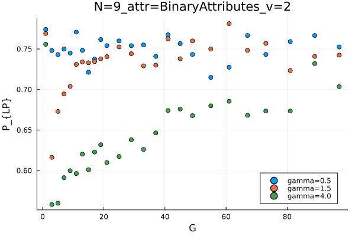

# PolarizationFramework

## Table of contents

- [About the project](#about-the-project)
- [Built with](#built-with)
- [Getting started](#getting-started)
  * [Installation](#installation)
- [Example](#example)
  * [The influence of growing number of attributes on the preventing polarization from forming](#the-influence-of-growing-number-of-attributes-on-the-preventing-polarization-from-forming)
  * [Result analysis](#result-analysis)
- [Attributes](#attributes)
# About the project
Framework containing agent-based models for the analysis of attribute influence on polarization observed in the system. 

It allows testing of effectiveness of different kinds of attributes in two scenarios:
-destabilization of the polarized system
-preventing of the forming of the polarized system. 

It allows to replicate results used to generate figures from the not yet published pre-print. 

This framework is authored by Piotr J Górski.

# Built with

This code base is using the Julia Language (1.6.4) and [DrWatson](https://juliadynamics.github.io/DrWatson.jl/stable/)
to make a reproducible scientific project. 

Update [11.09.2014]: When updating all the packages and changing the Julia version to 1.10.4 in the `Project.toml`, all tests were passed. This is however, not included in the current version of this package. 

# Getting started

## Installation

We are using `DrWatson` --- a package making scientific collaboration easier. 
Therefore, after cloning the project, open `julia` terminal in the project folder and write
```julia
using DrWatson
quickactivate(@__DIR__, "PolarizationFramework")
using PolarizationFramework
```
(To do the above you might need to `] add DrWatson` first.)
And you can start using the package. See examples in scripts folder or see instructions below. 

# Example

The folder `scripts` contain simulation examples that allow to obtain results that were used for the Preprint. 
Here, I will describe one of the files and the way to analyze the results. 

## The influence of growing number of attributes on the preventing polarization from forming

(see this [file](scripts/preventing_attr_G.jl))

Import package
```julia
using DrWatson
quickactivate(@__DIR__)

using PolarizationFramework
```

Set model structure parameters (in one simulation parameters may have only a single value, but this script allows to perform a series of simulations):
```julia
# Number of nodes
ns = [5, 9]
# Number of repetitions for numbers of nodes given above
reps = [100, 100]
reps_dict = Dict(zip(ns, reps))

# Considered numbers of attributes. 
gs = [1:2:21..., 25, 29, 33, 37, 41, 45, 49, 55, 61, 67, 73, 81, 89, 97]
# If one wants to test it in a shorter simulation it might be better just to:
# gs = [1:2:21...] 

threshold = 0.5

# Number of categories considered. For BinaryAttributes it does not matter. 
# When OrderedAttributes are chosen, then 1000 categories gives a continuous attribute. 
vs = [4, @onlyif("attr_types" == "OA", 1000)] #includes CA

# Abbreviations of considered attributes. 
# Mind that definition of `vs` above will allow to consider 5 cases: 
# BinaryAttributes, OrderedAttributes, UnorderedAttributes, 
# UnorderedPositiveAttributes and (approx.) continuous attributes. 
attr_types = ["BA", "UA", "OA", "UPA"]

# Considered coupling strengths. 
gammas = [0.5, 1.5, 4]
```

Creating sets of parameters to be simulated:
```julia
all_params = @strdict(ns, gs, threshold, vs, attr_types)
dicts = dict_list(all_params)
[d["reps"] = reps_dict[d["ns"]] for d in dicts]
```

Running simulations:
```julia
for params in dicts
    # Unpacking parameters
    n, g, attr_type, v, rep = let
        @unpack ns, threshold, reps, gs, attr_types, vs = params
        ns, gs, attr_types, vs, reps
    end

    println("Started n=$n and g=$g and attr_type=", attr_type, " and v=$v.")

    # Defining the proper attribute type
    if attr_type == "UA"
        attr = UnorderedAttributes(g, threshold, v)
    elseif attr_type == "BA"
        attr = BinaryAttributes(g)
    elseif attr_type == "OA"
        attr = OrderedAttributes(g, threshold, v)
    elseif attr_type == "UPA"
        attr = UnorderedPositiveAttributes(g, threshold, v)
    else
        throw(attr_type)
    end

    # Running the simulation for a set of gammas
    r = using_heider_attr(
        n,
        attr,
        gammas,
        rep,
        3000.0,
        "Heider7!";
        disp_each = 0,
        disp_more_every = 600,
        save_each = 600,
        files_folder = ["data", "sims"],
        filename_prefix = "NumerFig1",
    )
end
```
(If necessary see description of `use_heider_attr` in [file](src/MeasureHeiderBalance.jl))

Above code will generate 'mat' or 'jld2' files with results in the folder `data/sims`. All the files will be prefixed with 'NumerFig1'. 

## Result analysis

(see this [file](scripts/analyze_fig1.jl) or [notebook](notebooks/analyze_fig1.ipynb))

To analyze the file we need to import packages again (if they are missing, one needs to `] add ` them to the Julia registry). 

```julia
using DrWatson
quickactivate(@__DIR__)

using StatsBase
using Plots
using DataFrames
```

Then we can collect the data. The interesting data are located in folder `data/sims` and are prefixed "NumerFig1". 
```julia
# get data 
res = DrWatson.collect_results(
    datadir("sims"),
    rinclude = [r"NumerFig1[.]*"],
)
first(res[!, ["N", "G", "attr_name", "gamma", "LP", "GP", "HB", ]], 10)
```

<div class="data-frame"><p>10 rows × 7 columns</p><table class="data-frame"><thead><tr><th></th><th>N</th><th>G</th><th>attr_name</th><th>gamma</th><th>LP</th><th>GP</th><th>HB</th></tr><tr><th></th><th title="Union{Missing, UInt32}">UInt32?</th><th title="Union{Missing, UInt32}">UInt32?</th><th title="Union{Missing, String}">String?</th><th title="Union{Missing, Float64}">Float64?</th><th title="Union{Missing, Float64}">Float64?</th><th title="Union{Missing, Float64}">Float64?</th><th title="Union{Missing, Float64}">Float64?</th></tr></thead><tbody><tr><th>1</th><td>5</td><td>1</td><td>BinaryAttributes</td><td>0.5</td><td>0.78</td><td>0.94</td><td>1.0</td></tr><tr><th>2</th><td>5</td><td>1</td><td>BinaryAttributes</td><td>1.5</td><td>0.744</td><td>0.93</td><td>1.0</td></tr><tr><th>3</th><td>5</td><td>1</td><td>BinaryAttributes</td><td>4.0</td><td>0.744</td><td>0.92</td><td>1.0</td></tr><tr><th>4</th><td>9</td><td>1</td><td>BinaryAttributes</td><td>0.5</td><td>0.774167</td><td>1.0</td><td>1.0</td></tr><tr><th>5</th><td>9</td><td>1</td><td>BinaryAttributes</td><td>1.5</td><td>0.769167</td><td>1.0</td><td>1.0</td></tr><tr><th>6</th><td>9</td><td>1</td><td>BinaryAttributes</td><td>4.0</td><td>0.755833</td><td>1.0</td><td>1.0</td></tr><tr><th>7</th><td>5</td><td>3</td><td>BinaryAttributes</td><td>0.5</td><td>0.729</td><td>0.91</td><td>1.0</td></tr><tr><th>8</th><td>5</td><td>3</td><td>BinaryAttributes</td><td>1.5</td><td>0.744</td><td>0.8</td><td>0.82</td></tr><tr><th>9</th><td>5</td><td>3</td><td>BinaryAttributes</td><td>4.0</td><td>0.579</td><td>0.29</td><td>0.26</td></tr><tr><th>10</th><td>9</td><td>3</td><td>BinaryAttributes</td><td>0.5</td><td>0.748095</td><td>0.96</td><td>0.97</td></tr></tbody></table></div>

In above table we see respectively number of Nodes `N`, number of attributes `G`, attribute name, coupling strength, local polarization `LP`, global polarization `GP` and probability of reaching structural balance state `HB`. All available columns are described in [file](src/Results.jl). 

The results were collected. Now they have to be printed. In the case the same parameters were simulated multiple times, for instance to obtain better statistics, one would have to write a function that aggregates over these results. 

```julia
N = 9
attr_name = "BinaryAttributes" # ["BinaryAttributes", "OrderedAttributes", "UnorderedAttributes", "UnorderedPositiveAttributes"]
gamma = unique(res.gamma)
attr_degeneracy = 2 #It should be 2 for BA, 1000 for CA (OrderedAttributes). Otherwise 4 (in the currently-generated data). 

params = @strdict N attr_name gamma attr_degeneracy
dicts = dict_list(params)

p = plot()
for dict in dicts
    inds = ones(Bool, size(res)[1])

    for param in dict
        inds .*= res[!, string(param[1])] .== param[2]
    end

    plot!(p, res.G[inds], res.LP[inds], lab = "gamma="*string(dict["gamma"]))
end

plot(p, seriestype=:scatter, xlabel = "G", ylabel = "P_{LP}", legend = :bottomright)
attr = attr_name
v = attr_degeneracy
title!(savename(@ntuple(N, attr, v)))
```



# Attributes

In the current framework attributes used to impact polarization are assumed to have following parameters:
* their count: `g`
* threshold currently always set to 0.5 -- threshold changes which mean levels of similarity are considered to have positive/negative impact on relations
* degeneracy (i.e. number of possible categories an attribute can take): `v`

Currently following attributes are implemented:
* Binary attributes
* Ordered attributes
* Unordered attributes (named negative unordered attributes in the Preprint)
* Unordered positive attributes

To create another type of attribute (`OwnAttributes`), one has to:
* create a `struct` that inherits after `AbstractAttributes` and contains at least field `g` with number of attributes. 
```julia
struct OwnAttributes <: AbstractAttributes
    g
end
```
* implement `get_threshold(b::OwnAttributes)` if this is different from general `get_threshold(b::AbstractAttributes)`.
* implement `get_degeneracy(b::OwnAttributes)` if this is different from general `get_degeneracy(b::AbstractAttributes)`.
* implement a function generating random attributes `get_attributes(b::OwnAttributes, n::Int)` if this is different from general `get_attributes(b::AbstractAttributes, n::Int)`.
* implement a function calculating similarity weights `get_attribute_layer_weights(b::OwnAttributes, attr::AbstractArray{<:Number})` if this is different from general `get_attribute_layer_weights(b::AbstractAttributes, attr::AbstractArray{<:Number})`.