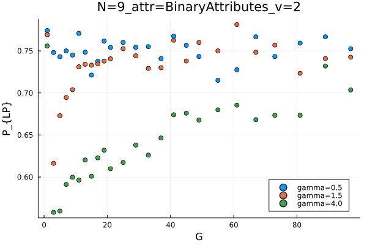

```julia
using DrWatson
quickactivate(@__DIR__)

using StatsBase
using Plots
using DataFrames
using CSV
```


```julia
res = DrWatson.collect_results(
        datadir("sims"),
        rinclude=[r"NumerFig1[.]*"]
        #   black_list = bl,
    )
first(res, 10)
```

    ┌ Info: Scanning folder /home/pgorski/Desktop/programming/curheider/PolarizationFramework/data/sims for result files.
    └ @ DrWatson /home/pgorski/.julia/packages/DrWatson/S4dYA/src/result_collection.jl:115
    ┌ Info: Added 750 entries.
    └ @ DrWatson /home/pgorski/.julia/packages/DrWatson/S4dYA/src/result_collection.jl:191


<div class="data-frame"><p>10 rows × 45 columns (omitted printing of 38 columns)</p><table class="data-frame"><thead><tr><th></th><th>ode_fun_name</th><th>LP</th><th>LP_std</th><th>zmax</th><th>pos_links_changed_std</th><th>BR_std</th><th>GP</th></tr><tr><th></th><th title="Union{Missing, String}">String?</th><th title="Union{Missing, Float64}">Float64?</th><th title="Union{Missing, Float64}">Float64?</th><th title="Union{Missing, Int64}">Int64?</th><th title="Union{Missing, Float64}">Float64?</th><th title="Union{Missing, Float64}">Float64?</th><th title="Union{Missing, Float64}">Float64?</th></tr></thead><tbody><tr><th>1</th><td>Heider7!</td><td>0.78</td><td>0.23355</td><td>100</td><td>1.41078</td><td>0.0</td><td>0.94</td></tr><tr><th>2</th><td>Heider7!</td><td>0.744</td><td>0.246724</td><td>100</td><td>1.38721</td><td>0.0</td><td>0.93</td></tr><tr><th>3</th><td>Heider7!</td><td>0.744</td><td>0.257541</td><td>100</td><td>1.56024</td><td>0.0</td><td>0.92</td></tr><tr><th>4</th><td>Heider7!</td><td>0.774167</td><td>0.0880763</td><td>100</td><td>2.51589</td><td>0.0</td><td>1.0</td></tr><tr><th>5</th><td>Heider7!</td><td>0.769167</td><td>0.0916361</td><td>100</td><td>2.21954</td><td>0.0</td><td>1.0</td></tr><tr><th>6</th><td>Heider7!</td><td>0.755833</td><td>0.10275</td><td>100</td><td>2.383</td><td>0.0</td><td>1.0</td></tr><tr><th>7</th><td>Heider7!</td><td>0.729</td><td>0.267157</td><td>100</td><td>1.11916</td><td>0.0</td><td>0.91</td></tr><tr><th>8</th><td>Heider7!</td><td>0.744</td><td>0.228884</td><td>100</td><td>1.32035</td><td>0.154449</td><td>0.8</td></tr><tr><th>9</th><td>Heider7!</td><td>0.579</td><td>0.25198</td><td>100</td><td>1.46677</td><td>0.219317</td><td>0.29</td></tr><tr><th>10</th><td>Heider7!</td><td>0.748095</td><td>0.127319</td><td>100</td><td>2.54455</td><td>0.0465874</td><td>0.96</td></tr></tbody></table></div>


```julia
N = 9
attr_name = "BinaryAttributes" # ["BinaryAttributes", "OrderedAttributes", "UnorderedAttributes", "UnorderedPositiveAttributes"]
gamma = unique(res.gamma)
attr_degeneracy = 2 #It should be 2 for BA, 1000 for CA (OrderedAttributes). Otherwise 4. 

params = @strdict N attr_name gamma attr_degeneracy
dicts = dict_list(params)

p = plot()
for dict in dicts
    inds = ones(Bool, size(res)[1])

    for param in dict
        inds .*= res[!, string(param[1])] .== param[2]
    end

    plot!(p, res.G[inds], res.LP[inds], seriestype=:scatter, lab = "gamma="*string(dict["gamma"]))
end

plot(p, xlabel = "G", ylabel = "P_{LP}", legend = :bottomright)
attr = attr_name
v = attr_degeneracy
title!(savename(@ntuple(N, attr, v)))
```


    

    


```julia
names(res)[20:end]
```


    26-element Vector{String}:
     "HB_x"
     "attr_threshold"
     "HB"
     "Delta3"
     "times_std"
     "times"
     "neg_links_destab_std"
     "Delta1"
     "Delta0_std"
     "Delta3_std"
     "pos_links_changed"
     "hell"
     "neg_links_changed"
     "neg_links_changed_std"
     "attr_degeneracy"
     "x_attr_sim_std"
     "pos_links_destab_std"
     "BR"
     "N"
     "G"
     "initial_neg_links_count"
     "initial_neg_links_count_std"
     "gamma"
     "neg_links_destab"
     "attr_name"
     "path"


```julia
first(res[!, ["N", "G", "attr_name", "gamma", "LP", "GP", "HB", ]], 10)
```


<div class="data-frame"><p>10 rows × 7 columns</p><table class="data-frame"><thead><tr><th></th><th>N</th><th>G</th><th>attr_name</th><th>gamma</th><th>LP</th><th>GP</th><th>HB</th></tr><tr><th></th><th title="Union{Missing, UInt32}">UInt32?</th><th title="Union{Missing, UInt32}">UInt32?</th><th title="Union{Missing, String}">String?</th><th title="Union{Missing, Float64}">Float64?</th><th title="Union{Missing, Float64}">Float64?</th><th title="Union{Missing, Float64}">Float64?</th><th title="Union{Missing, Float64}">Float64?</th></tr></thead><tbody><tr><th>1</th><td>5</td><td>1</td><td>BinaryAttributes</td><td>0.5</td><td>0.78</td><td>0.94</td><td>1.0</td></tr><tr><th>2</th><td>5</td><td>1</td><td>BinaryAttributes</td><td>1.5</td><td>0.744</td><td>0.93</td><td>1.0</td></tr><tr><th>3</th><td>5</td><td>1</td><td>BinaryAttributes</td><td>4.0</td><td>0.744</td><td>0.92</td><td>1.0</td></tr><tr><th>4</th><td>9</td><td>1</td><td>BinaryAttributes</td><td>0.5</td><td>0.774167</td><td>1.0</td><td>1.0</td></tr><tr><th>5</th><td>9</td><td>1</td><td>BinaryAttributes</td><td>1.5</td><td>0.769167</td><td>1.0</td><td>1.0</td></tr><tr><th>6</th><td>9</td><td>1</td><td>BinaryAttributes</td><td>4.0</td><td>0.755833</td><td>1.0</td><td>1.0</td></tr><tr><th>7</th><td>5</td><td>3</td><td>BinaryAttributes</td><td>0.5</td><td>0.729</td><td>0.91</td><td>1.0</td></tr><tr><th>8</th><td>5</td><td>3</td><td>BinaryAttributes</td><td>1.5</td><td>0.744</td><td>0.8</td><td>0.82</td></tr><tr><th>9</th><td>5</td><td>3</td><td>BinaryAttributes</td><td>4.0</td><td>0.579</td><td>0.29</td><td>0.26</td></tr><tr><th>10</th><td>9</td><td>3</td><td>BinaryAttributes</td><td>0.5</td><td>0.748095</td><td>0.96</td><td>0.97</td></tr></tbody></table></div>


